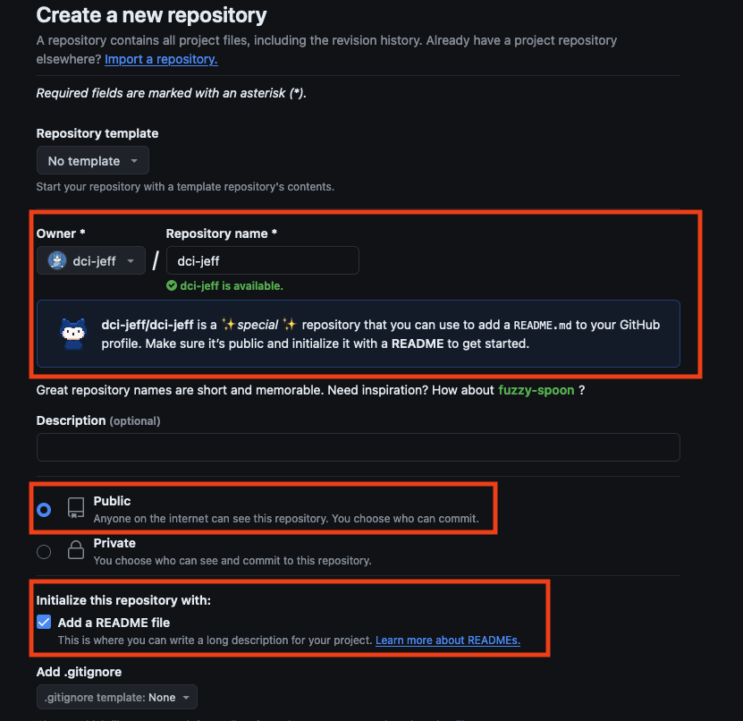
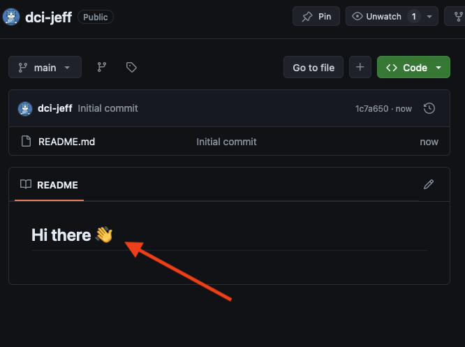
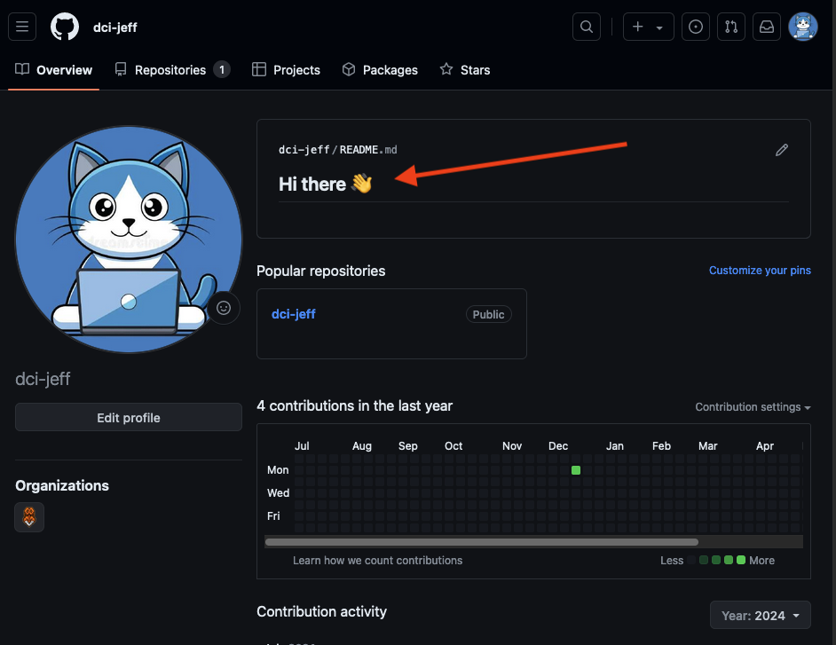

# Hinzufügen und erstellen einer Profil README

## Schritt 1
Unter den folgenden [Link](https://docs.github.com/de/get-started/start-your-journey/setting-up-your-profile) findet ihr etwa mittig auf der Seite unter dem Punkt **"Hinzufügen einer Profil-README"** die Anleitung von GitHub zur Erstellung eines Profil Repositorys für eine Profil README.

Hier die Kurzfassung:
- Erstelle ein neues Repo mit dem Titel deines GitHub Usernames.
Siehe hier:

Sobald du deinen Usernamen als Reponamen eingibst, wirst du darauf hingewiesen, dass es sich hierbei um ein spezielles Repo handelt. Wichtig dabei ist, dass das Repo **public** sein und mit einer **README file** initialisiert werden muss.

---

## Schritt 2

- Hast du dies getan, kannst du das Repo erstellen und wirst auf die Seite des gerade erstellten Repos weitergeleitet. Das sollte in etwa so aussehen:

Hier siehst du noch mal, dass der Name deines Repos identisch mit dem deines GitHub Usernames ist. Auch sieht du hier die bereits mit "Hi there 👋" vorausgefüllt README Datei, die du nun nach deinen Wünschen anpassen kannst.

---

## Schritt 3

- Dies ist weniger ein Schritt, eher die Betrachtung des Endresultates. Habt ihr eure README euren Wünschen entsprechend angepasst, könnt ihr das Ergebnis jetzt nicht nur in eurem Repo betrachten, sondern auch direkt auf eurem GitHub Profil. 
Siehe hier:

Hier seht ihr direkt auf der Startseite den Inhalt der zuvor bearbeiteten README. 

Hier noch ein paar Beispiele von kreativ gestalteten GitHub Profilen:
- [Beispiel 1](https://github.com/ndimoforaretas)
- [Beispiel 2](https://github.com/Aryanipuspitasari)
- [Beispiel 3](https://github.com/walidbosso)