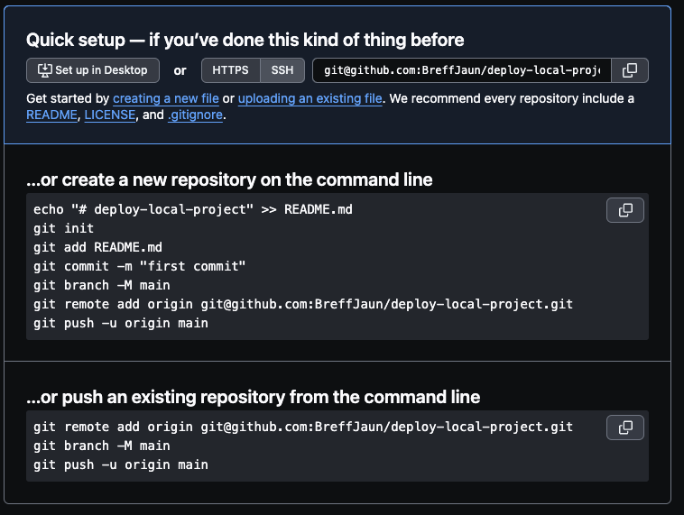

# Deployment - Websites veröffentlichen

## GitHub Pages

### Vanilla Project (HTML & CSS) 
- Erstelle ein neues GitHub Repository. Das Repository muss auf `Public` gestellt sein (außer ihr GitHub Pro User) und initialisiert dieses direkt mit einer README.md file.
- Clone dein Projekt wie üblich mit der SSH URL und öffne das Projekt
- Arbeite an deinem Projekt und `commit` deine Änderungen
- Gehe im Browser, in deinem Repository auf `Settings` und dann links in der Spalte auf `Pages`
- Wähle unter `Branch` main aus. Daraus ergibt sich die Möglichkeit den root Folder zu bestimmen. Diesen könnt ihr auf `/` (also der root Ebene) stehen lassen, da sich die `index.html` Datei nicht in einem Unterordner befindet.
- Klick auf `save`.
- Auf der Startseite  (oder unter Actions) könnt ihr nun beobachten, dass das Deployment gestartet wurde. 
- Nach einiger Zeit könnt ihr unten rechts unter `Deployments` die URL zu eurem deployten Projekt finden.

### Astro Project
- Erstelle ein neues GitHub Repository. Das Repository muss auf Public gestellt sein (außer ihr GitHub Pro User) und initialisiert dieses direkt mit einer README file.
- Clone dein Projekt wie üblich mit der SSH URL und öffne das Projekt
- Initialisiere ein neues `Astro` Projekt mit `npm create astro@latest`.
- Hinweis! => Bei der ersten Frage der Installation könnt ihr (wenn das Repo leer ist) auch `./` eingeben. Dann wird das Projekt ohne weiteren Unterordner direkt angelegt.
- Gehe in die `astro.config.mjs` Datei und passe sie wie folgt an:
  
```mjs
export default defineConfig({
  site: "https://GHUsername.github.io",
  base: "repo-name",
});
```
- Befindet sich euer Repo auf root Ebene, sollt ihr `base` nicht ausfüllen!
- Erstelle folgende Ordner mit folgender Datei: `.github/workflows/deploy.yml` 
- Der Inhalt zur `deploy.yml` ist von Astro vorgegeben und kann [hier](https://docs.astro.build/en/guides/deploy/github/) gefunden werden. Den Inhalt von der Seite einfach kopieren und in der Datei einfügen.
- Gehe im Browser, in deinem Repository auf `Settings` und dann links in der Spalte auf `Pages`
- Wähle unter `Build and Deployment` als `Source` => `GitHub Actions` aus.
- Arbeite an deinem Projekt und commite deine Änderungen
- Durch das commiten und die erstellte `deploy.yml` wird ein Deploy auf GitHub Pages automatisch getriggert.
- Nach einiger Zeit könnt ihr nun unten rechts unter `Deployments` die URL zu eurem deployten Projekt finden.
  
[Astro Documentation für das Deployen auf GH Pages](https://docs.astro.build/en/guides/deploy/github/)

## Vercel

=> Falls zu diesem Zeitpunkt noch nicht geschehen, erstellt euch einen Vercel Account. Macht dies NICHT mit dem DCI E-Mail-Account, da ihr sonst nach Kursende keinen Zugriff mehr auf den Account und die darin deployten Projekte habt.

- Account erstellen:
  - `Hobby` auswählen
  - Namen einfügen
  - `Continue mit GitHub` wird empfohlen. Dafür müsst ihr bei eurem GH Acoount eingeloggt sein.
  - Authorize Vercel
  - Install GH App für deinen Account
  - Fertig


### Vanilla Project (HTML & CSS)
- `Add new...` => `Project`
- `Project Name` kann so übernommen werden
- `Framework Preset` => bei Vanilla Projekten auf `Other` lassen.
- `Root Directory` kann auf `./` bleiben.
- `Build and Output Settings` sind bereits korrekt von Vercel ausgefüllt.
-  Es sind keine weiteren Einstellungen notwendig. Es kann auf `Deploy` geklickt werden.
- Warten, bis die Seite deployed wurde und das Ergebnis betrachten.

### Astro Project
- `Add new...` => `Project`
- `Project Name` kann so übernommen werden
- `Framework Preset` => da Vercel sehr Astro freundlich ist, ist das richtige Framework bereits vorausgefüllt.
- `Root Directory` kann auf `./` bleiben.
- `Build and Output Settings` sind bereits korrekt von Vercel für Astro ausgefüllt.
-  Es sind keine weiteren Einstellungen notwendig. Es kann auf `Deploy` geklickt werden.
- Warten, bis die Seite deployed wurde und das Ergebnis betrachten

[Astro Documentation für das Deployen auf Vercel](https://docs.astro.build/en/guides/deploy/vercel/)
  
---

# Lokales Repository initialisieren und zum GitHub Repository machen

## Repository initialisieren
- `git init` => Dieser Befehl initialisiert ein neues Git-Repository im aktuellen Verzeichnis. Er erstellt ein verstecktes .git-Verzeichnis, in dem alle relevanten Metadaten und Versionsinformationen gespeichert werden.
- `git status` => Den Git Status Abfragen. Damit kann man auch ganz simpel testen, ob die Initialisierung funktioniert hat.
- Änderungen im Repository vornehmen und commiten
- Erstelle ein neues GitHub Repository. Da ihr schon Dateien habt, erstellt ihr dieses mal KEINE README.md.
  


- `...or push an existing repository from the command line` => wie der Titel schon sagt, müssen wir uns hier drauf konzentrieren. Mit dem Copy-Button den Code kopieren und im Lokalen Repo (ihr müsst auf dem Pfad eures Projektes sein) im Terminal einfügen und ausführen.
- Auf GitHub können wir nun prüfen, ob das Repo den Inhalt des lokalen Repos erhalten hat. Wenn der Inhalt angekommen ist, hat die Verbindung funktioniert.
- Von hier an, kann das Repository dann wieder so deployed werden, wie man möchte.

