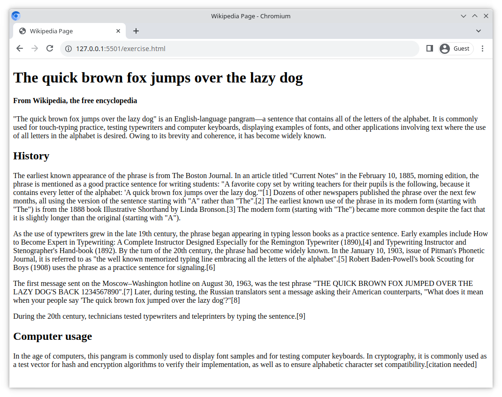

# Make a Wikipedia Webpage

Make a Wikipedia-like webpage from an example image.

## Task

Open the file `index.html`.

In your code editor, wrap each line of text with a suitable HTML tag so that the page looks exactly like the image below.

> Text retrieved from the Wikipedia article [The quick brown fox jumps over the lazy dog](https://en.wikipedia.org/wiki/The_quick_brown_fox_jumps_over_the_lazy_dog), available under the [Creative Commons Attribution-ShareAlike License](https://creativecommons.org/licenses/by-sa/4.0/)
