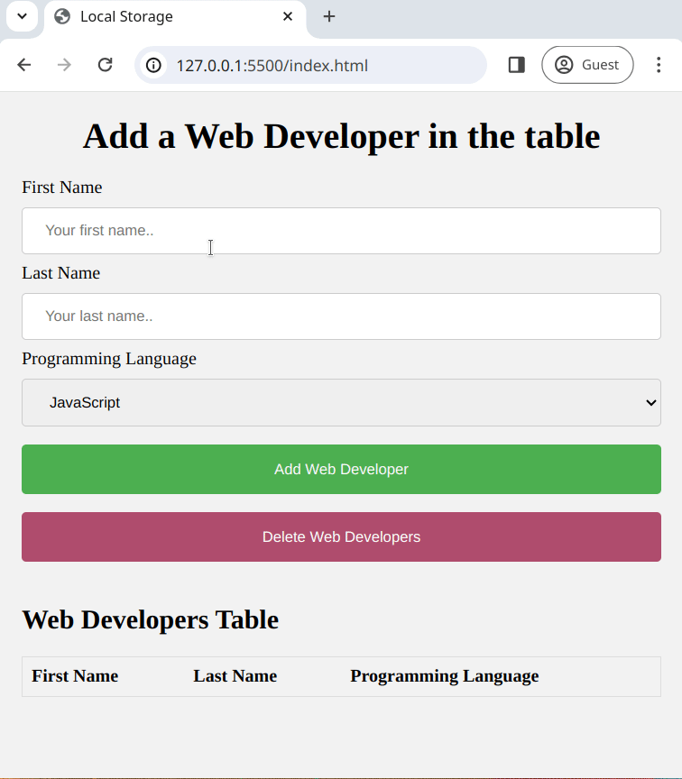

# Arbeiten mit localStorage

localStorage ermöglicht es Entwicklern, Daten im Browser zu speichern und abzurufen. Die im Local Storage gespeicherten Daten verfallen nicht. Das bedeutet, dass die Daten erhalten bleiben, auch wenn der Tab oder das Browserfenster geschlossen wird.

## Aufgaben

Um die Leistungsfähigkeit der [localStorage API](https://developer.mozilla.org/en-US/docs/Web/API/Window/localStorage) zu demonstrieren, werden wir Daten aus einem Formular sammeln und in unserem localStorage speichern.

Für diese Übung musst Du nur die Datei [main.js](./main.js) bearbeiten.

### Aufgabe 1

Lese das gegebene HTML in [index.html](./index.html).

### Aufgabe 2 - Erfassen der Formulardaten

Basierend auf dem oben untersuchten HTML, erstelle eine JavaScript-Funktion `addDeveloperToTable` in [main.js](./main.js), die;

1. Durch das `click`-Ereignis des `<button>` mit der ID `send-form` ausgelöst wird
2. Die Formulardaten aus dem `<form>` mit der ID `form` erfasst
3. Die Werte des Formulars in ein Objekt namens `newDeveloper` einfügt

> Das Objekt `newDeveloper` sollte 3 Schlüssel haben, `firstName`, `lastName` und `programmingLanguage`

### Aufgabe 3 - Überprüfung des localStorage

Wir gehen davon aus, dass der localStorage bereits Daten enthält. Wir möchten zu den vorhandenen Daten _hinzufügen_ (auch wenn sie noch nicht existieren), **anstatt sie zu ersetzen**.

Wir können dies erreichen, indem wir unsere Daten in einem Array speichern.

Aktualisiere die Funktion `addDeveloperToTable`, die Du in Aufgabe 2 erstellt hast, um;

1. Den Inhalt des localStorage für den Schlüssel `developers` zu überprüfen
2. Eine Bedingung zu schreiben;
   - Wenn der Schlüssel `developers` `null` zurückgibt, setze den Schlüssel `developers` im `localStorage` auf ein Array mit dem Objekt `newDeveloper` als einzigem Element im Array
   - Wenn der Schlüssel `developers` ein Array zurückgibt, füge das Objekt `newDeveloper` zum Array hinzu und setze das Array auf den Schlüssel `developers` im `localStorage`

### Aufgabe 4 - Teste deinen Code

Teste, ob der `localStorage` korrekt beschrieben wird, entweder mit;

- `console.log()`
- Den Entwicklertools des Browsers

> **Autsch! Ist etwas schiefgelaufen?** 🐷
>
> Ein häufiger Fehler, den Entwickler machen, ist das Vergessen der Verwendung von `JSON.parse()` und `JSON.stringify()`.
>
> Warum denkst Du, ist es wichtig, diese Funktionen beim Arbeiten mit `localStorage` zu verwenden?

### Aufgabe 5 - Leeren der Felder

Aktualisiere die Funktion `addDeveloperToTable`, sodass sie auch das Formular zurücksetzt;

- Sie sollte die `<input />`-Felder leeren
- Sie sollte das `<select>`-Feld auf seinen Standardwert zurücksetzen

### Aufgabe 6 - Entfernen des Entwickler-Elements aus dem localStorage

Erstelle eine JavaScript-Funktion `clearLocalStorage` in [main.js](./main.js), die;

1. Durch das `click`-Ereignis des `<button>` mit der ID `reset-form` ausgelöst wird
2. Das Element `developers` aus dem localStorage entfernt

### Aufgabe 7 - Anzeige der Entwickler

Erstelle die Funktion `displayDevelopers`, die bei Ausführung;

1. Das Element `developers` aus dem `localStorage` abruft
2. Das HTML `<table>` mit der ID `developer-list` mit dem Array von `developers` aktualisiert

### Aufgabe 8

- Führe die Funktion `displayDevelopers` beim Seitenladen aus
- Führe die Funktion `displayDevelopers` aus, nachdem die Funktion `addDeveloperToTable` den `localStorage` aktualisiert hat

## Erwartetes Ergebnis

## Bonusaufgaben

### Keine leeren Felder

Erstelle eine Bedingung, die nur erlaubt, die Formulardaten in `localStorage` zu speichern, **wenn** alle Werte in den `<input />`-Feldern ausgefüllt wurden.
