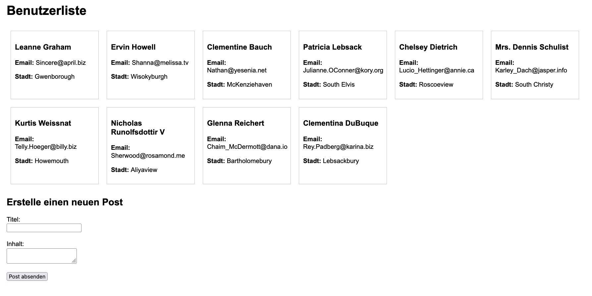

**Aufgabe: Entwicklung einer einfachen Webanwendung mit async/await und POST-Requests**

**Beschreibung:**
Erstelle eine Webanwendung, die folgende Funktionen bietet:

1. **Anzeigen von Benutzerdaten:**
   - Beim Laden der Seite sollen Benutzerdaten von `https://jsonplaceholder.typicode.com/users` abgerufen und angezeigt werden.
   - Zeige den Namen, die E-Mail-Adresse und die Stadt jedes Benutzers an.

2. **Erstellen eines neuen Posts:**
   - Biete dem Benutzer ein Formular an, um einen neuen Post zu erstellen.
   - Das Formular sollte Felder für den Titel und den Inhalt des Posts enthalten.
   - Nach dem Absenden soll ein POST-Request an `https://jsonplaceholder.typicode.com/posts` gesendet werden.
   - Zeige eine Bestätigungsmeldung an, wenn der Post erfolgreich erstellt wurde.

**Anforderungen:**

- **Verwendung von async/await:**
  - Alle asynchronen Operationen sollen mit `async/await` umgesetzt werden.

- **Fetch API:**
  - Verwende die Fetch API für HTTP-Requests.

- **Keine Verwendung von Bibliotheken:**
  - Nutze reines JavaScript ohne zusätzliche Libraries wie jQuery oder Axios.

- **Fehlerbehandlung:**
  - Implementiere eine angemessene Fehlerbehandlung für HTTP-Fehler oder Netzwerkprobleme.
  - Informiere den Benutzer über etwaige Fehler.

**Schritte zur Umsetzung:**

Wichtig: Du brauchst nur die script.js Datei zu bearbeiten. 

1. **Benutzerdaten abrufen und anzeigen:**
   - Implementiere die Funktion `fetchUsers()`, die die Benutzerdaten mit einem GET-Request abruft.
   - Verwende `async/await` und die Fetch API.
   - Verarbeite die erhaltenen Daten und füge sie dem DOM hinzu, um sie auf der Seite anzuzeigen.

2. **POST-Request senden:**
   - Implementiere eine Funktion `createPost(event)`, die das Absenden des Formulars verarbeitet.
   - Verwende `event.preventDefault()`, um das Standardverhalten des Formulars zu verhindern.
   - Sende die Formulardaten mit einem POST-Request an `https://jsonplaceholder.typicode.com/posts`.
   - Verwende `async/await` und die Fetch API.

3. **Bestätigung anzeigen:**
   - Nach erfolgreichem Senden soll eine Bestätigungsmeldung auf der Seite angezeigt werden.
   - Leere die Formularfelder nach dem Absenden.

4. **Fehlerbehandlung hinzufügen:**
   - Füge `try...catch` Blöcke hinzu, um Fehler bei den Fetch-Requests abzufangen.
   - Zeige dem Benutzer eine Fehlermeldung an, falls etwas schiefgeht.

**Optional: Erweiterungen für Interessierte:**
- **Validierung:**
  - Stelle sicher, dass die Formularfelder nicht leer sind, bevor der POST-Request gesendet wird.

- **Laden-Animation:**
  - Zeige eine Ladeanimation oder einen Hinweis an, während die Daten abgerufen werden.

- **Posts des Benutzers anzeigen:**
  - Implementiere eine Funktion, um die Posts eines ausgewählten Benutzers anzuzeigen.

- **Responsive Design:**
  - Sorge dafür, dass die Anwendung auf verschiedenen Bildschirmgrößen gut aussieht.

**Ressourcen:**

- **jsonplaceholder API Dokumentation:**
  - [https://jsonplaceholder.typicode.com/guide/](https://jsonplaceholder.typicode.com/guide/)

- **Fetch API Referenz:**
  - [MDN Web Docs - Fetch API](https://developer.mozilla.org/de/docs/Web/API/Fetch_API)

- **async/await Erklärung:**
  - [MDN Web Docs - async function](https://developer.mozilla.org/de/docs/Web/JavaScript/Reference/Statements/async_function)

**Beispiel**
