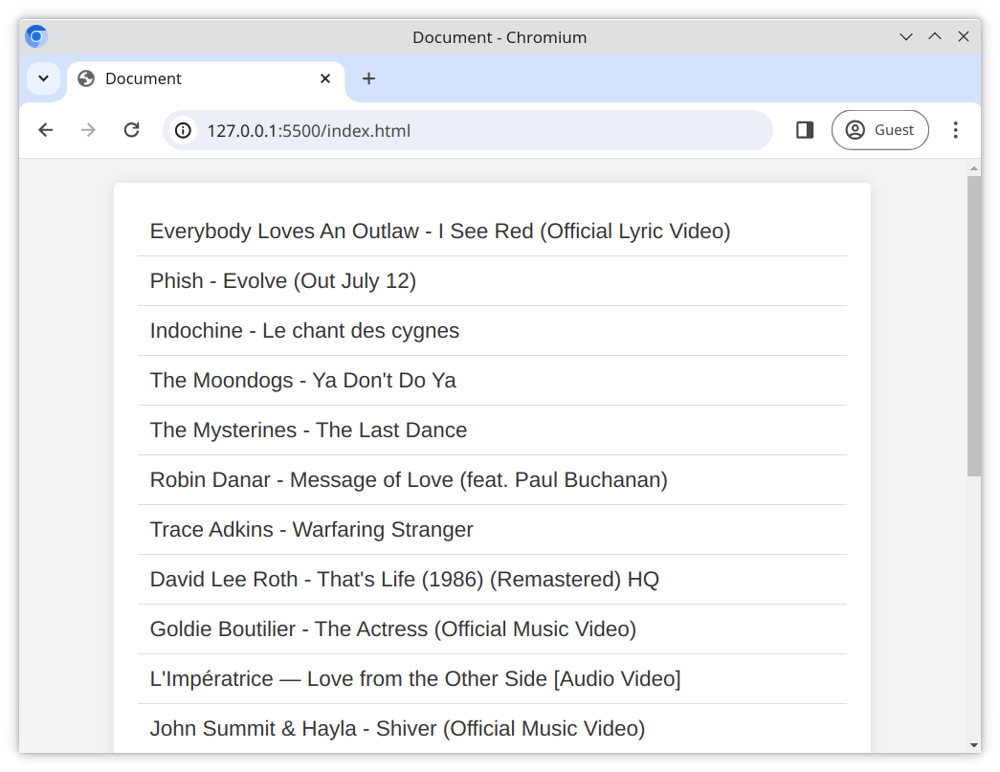

# Fetch and Display Tracks with Openwhyd API

In this exercise, you will fetch data from [Openwhyd](https://openwhyd.org). Openwhyd is a platform that curates music tracks from multiple sources.

## Tasks

You will get your data from the [Openwhyd Data Export API](https://openwhyd.github.io/openwhyd/API#openwhyd-data-export-api). This API does not require authentication (you do not need an account to use it).

The Openwhyd API doesn't include CORS headers, so to access the API you will need to make use of a CORS proxy, [corsproxy](https://corsproxy.io/).

Work in the files [index.html](./index.html), [main.js](./main.js) and [styles.css](./styles.css).

### Task 1 - Reading the documentation

Familiarize yourself with the [API documentation](https://openwhyd.github.io/openwhyd/API#openwhyd-data-export-api).

### Task 2 - Fetching track data

Using the API;

- Make a GET request to fetch the "hot tracks" in JSON format

### Task 3 - Create the track URLs

Using the returned data, read the `eid` property for each track listing to create a track URL to the song. For example;

- An `eid` beginning with `/yt/` is a YouTube track
- An `eid` of the value `/yt/JPkRZkLj6Ek` can be formatted to the YouTube URL `https://youtube.com/watch?v=JPkRZkLj6Ek`
- You can find a full list of examples [here](https://openwhyd.github.io/openwhyd/API#formats-and-appendix)

> Note: You may have to look up how to create a valid URL for other platforms, such as SoundCloud and Vimeo

### Task 4 - Render tracks onto the webpage

Once you have a list of URLs, **for each URL**;

- Render onto the webpage a clickable `<a>` link
- The link should open the URL in a new tab when clicked

> Hint: Set the target attribute of the `a` tag to `_blank` to open the tracks in new tabs

### Task 5 - Styling

Style your application with [styles.css](./styles.css)

## Expected Result

